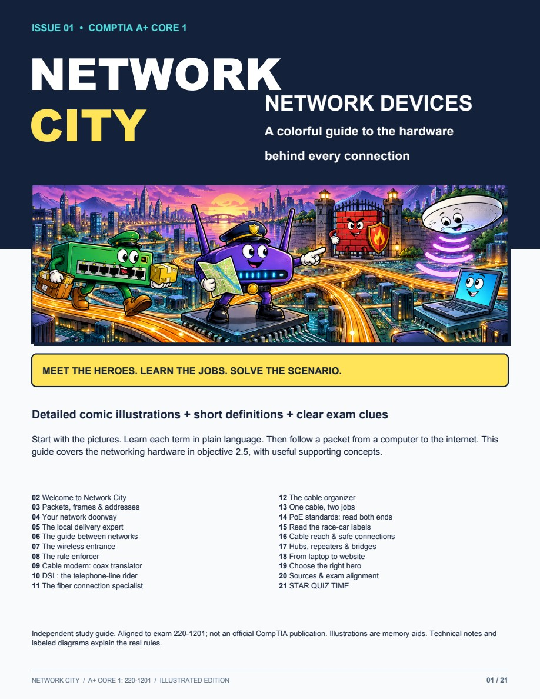
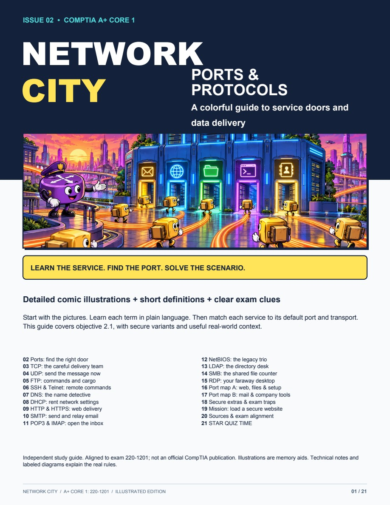
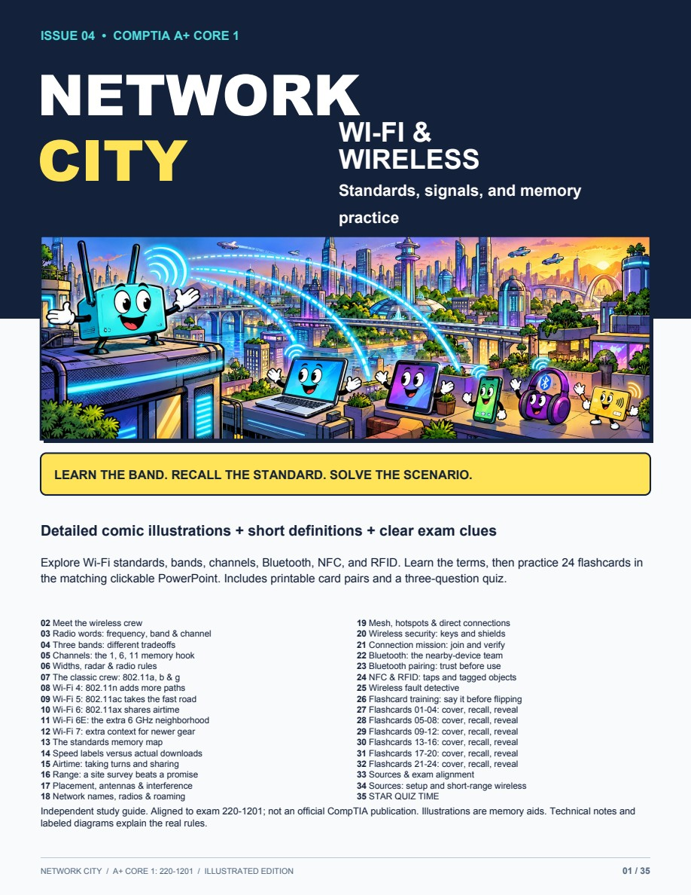
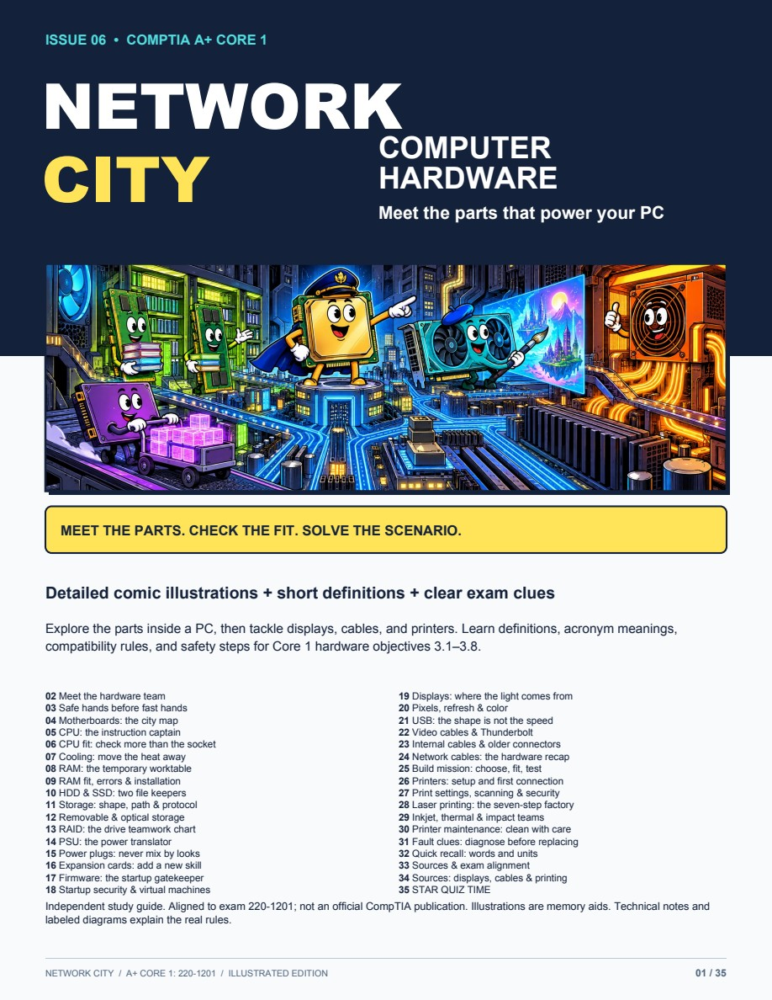
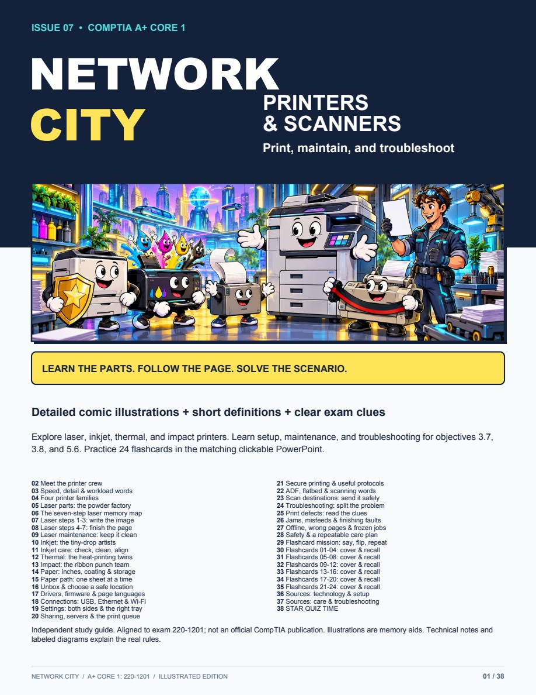
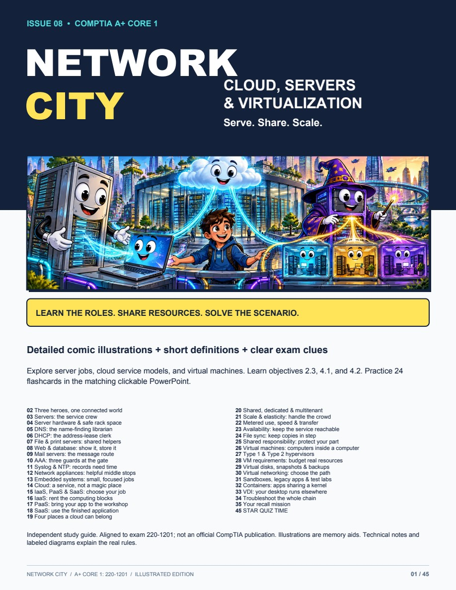

# Illustrated Study Guides

Colorful comic lessons with detailed illustrations, plain-language definitions, acronym meanings, practical examples, and short quizzes. These original study materials complement the [complete Core 1 notes](../core-1-study-guide.md).

[Browse all subjects](../../CATEGORY-INDEX.md) · [How to add a guide](CONTRIBUTING.md) · [Machine-readable catalog](catalog.json)

## CompTIA A+ Core 1 — 220-1201

### Available now

| Issue | Guide | Subject | Primary objective | Format |
|---|---|---|---|---|
| 01 | [Network Devices — Network City](core-1-220-1201/networking/01-network-devices/README.md) | Networking | 2.5: networking hardware | Illustrated PDF + searchable text |
| 02 | [Ports and Protocols — Network City](core-1-220-1201/networking/02-ports-and-protocols/README.md) | Networking | 2.1: ports, protocols, and purposes | Illustrated PDF + searchable text |
| 04 | [Wi-Fi Standards and Wireless — Network City](core-1-220-1201/networking/04-wireless-standards/README.md) | Networking / wireless | 2.2: wireless technologies | Illustrated PDF + interactive PowerPoint + text |
| 06 | [Computer Hardware — Network City](core-1-220-1201/hardware/06-computer-hardware/README.md) | Hardware | 3.1–3.8: components, displays, cables, and printers | Illustrated PDF + searchable text |
| 07 | [Printers and Scanners — Network City](core-1-220-1201/hardware/07-printers/README.md) | Hardware / printers | 3.7, 3.8, 5.6: setup, maintenance, troubleshooting | Illustrated PDF + interactive PowerPoint + text |
| 08 | [Cloud, Servers, and Virtualization — Network City](core-1-220-1201/virtualization-cloud/08-cloud-servers-virtualization/README.md) | Virtualization / cloud / server roles | 2.3, 4.1, 4.2 | Illustrated PDF + interactive PowerPoint + text |

### Network City: Issue 01

**21 pages · 13 original comic illustrations · 3-question quiz with explained answers**

Meet NICs, switches, routers, access points, firewalls, cable/DSL modems, ONTs, patch panels, and PoE. Includes Ethernet speed labels, cable reach, PoE source/device ratings, and a packet journey.

[Open the guide and download options](core-1-220-1201/networking/01-network-devices/README.md) · [Read the text version](core-1-220-1201/networking/01-network-devices/lesson.md)

### Network City: Issue 02

**21 pages · 13 new comic illustrations · 3-question quiz with explained answers**

Meet TCP and UDP, learn every service in objective 2.1, and use two port maps to connect numbers with real jobs. Includes secure variants and a complete website-loading mission.

[Open the guide and download options](core-1-220-1201/networking/02-ports-and-protocols/README.md) · [Read the text version](core-1-220-1201/networking/02-ports-and-protocols/lesson.md)

### Network City: Issue 04

**35 pages · 14 original comic illustrations · 24 interactive flashcards · 3-question quiz**

Learn Wi-Fi standards, bands, channels, performance, security, Bluetooth, NFC, and RFID. Use the 59-slide PowerPoint in Slide Show mode to reveal answers and retry cards. Includes 22 primary references and feet/inches for distances.

[Download the PDF and interactive deck](core-1-220-1201/networking/04-wireless-standards/README.md) · [Read the text version](core-1-220-1201/networking/04-wireless-standards/lesson.md)

### Network City: Issue 06

**35 pages · 18 original comic illustrations · 3-question quiz with explained answers**

Explore CPUs, motherboards, RAM, storage/RAID, cooling, power, displays, cables, and printers. Includes acronym meanings, compatibility checks, safety notes, and 32 primary references.

[Open the guide and download options](core-1-220-1201/hardware/06-computer-hardware/README.md) · [Read the text version](core-1-220-1201/hardware/06-computer-hardware/lesson.md)

### Network City: Issue 07

**38 pages · 12 original comic illustrations · 24 interactive flashcards · 3-question quiz**

Learn laser, inkjet, thermal, and impact printers; all seven laser stages; setup, scanning, maintenance, and troubleshooting. Includes definitions, paper sizes in inches, and 24 primary references.

[Download the PDF and interactive deck](core-1-220-1201/hardware/07-printers/README.md) · [Read the text version](core-1-220-1201/hardware/07-printers/lesson.md)

### Network City: Issue 08

**45 pages · 12 original comic illustrations · 24 interactive flashcards · 3-question quiz**

Explore server roles, cloud service and deployment models, shared responsibility, hypervisors, virtual machines, containers, and VDI. Includes acronym meanings, practical scenarios, and 28 primary references.

[Download the PDF and interactive deck](core-1-220-1201/virtualization-cloud/08-cloud-servers-virtualization/README.md) · [Read the text version](core-1-220-1201/virtualization-cloud/08-cloud-servers-virtualization/lesson.md)

### Planned lessons

These are the agreed next topics, not published downloads. Issue numbers describe the series order, not CompTIA objective numbers.

| Planned issue | Topic | Subject folder | Status |
|---|---|---|---|
| 03 | IP Addressing | Networking | Planned |
| 05 | Network Cables | Hardware / cabling | Planned |

## Organization

Guides are grouped by **exam version → subject → numbered lesson**. The index can grow to include other exams and subjects without moving existing downloads. Each available lesson has its own landing page, PDF, cover, and searchable text. Published files use stable names; Git history records updates.

- **Networking:** devices, ports/protocols, IP addressing, and wireless.
- **Hardware:** network cables/connectors and computer components.
- **Virtualization and cloud:** cloud services, virtual machines, containers, and server roles.
- **Future subjects:** mobile devices and troubleshooting as guides become available.

## Accuracy and attribution

This is independent learning material, not an official CompTIA publication. Follow the [official 220-1201 exam objectives](https://assets.ctfassets.net/82ripq7fjls2/1oSdlyujpaX3GrM0rir6Ge/91afb2be72785281e8fb4c0d9a70c6f4/CompTIA-A-220-1201-Exam-Objectives-3.0.pdf) for exam scope. Each guide records its review date and sources. Artwork is AI-generated and uses memory-aid metaphors; technical notes explain actual device behavior.
